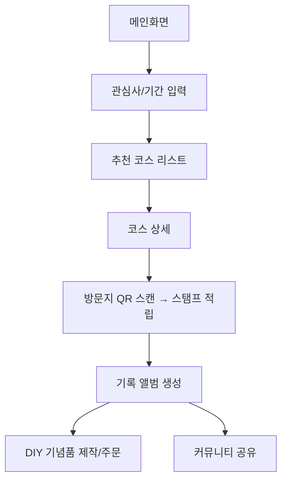

 🔹 개발자용 PRD: 포항 스토리 텔러

## 1. 제품 개요

* **목적**: 포항 지역 관광객에게 스토리 기반 여행 경험 제공
* **형태**: 반응형 웹 플랫폼 (모바일/데스크탑)
* **핵심 기능**: 스토리 탐험, QR 스탬프 투어, 디지털 앨범, DIY 기념품, 커뮤니티, AI 추천

---

## 2. 기능 명세

### 2.1 스토리 탐험

* **입력**: 관심사, 여행기간, 동반자 유형
* **출력**: 맞춤형 코스 리스트 (카드뷰)
* **UI**: 필터 + 추천 리스트
* **API**: `/api/courses/recommend`

### 2.2 스토리 코스 상세

* 코스 개요, 지도 기반 동선, 예상 소요 시간
* 이미지 + 텍스트 기반 스토리 제공

### 2.3 디지털 콘텐츠

* 방문지별 숏폼 영상(15~30초), 브랜드 필름(60~90초) 제공
* 사용자가 숏폼 제작 → 저장/공유

### 2.4 디지털 스탬프 투어

* **프로세스**: QR 스캔 → 서버 검증 → 스탬프 적립
* 모든 스탬프 획득 시 쿠폰/배지 보상
* **데이터**: UserStamp {userId, locationId, timestamp}

### 2.5 기록 앨범

* 자동 앨범 생성 (날짜/장소/테마 분류)
* IndexedDB 기반 로컬 저장 + 클라우드 싱크

### 2.6 DIY 기념품

* 앨범 → 포항4컷/포토북 제작
* 결제: PortOne(아임포트) API 연동

### 2.7 커뮤니티

* 사진/숏폼 공유, 좋아요/댓글 기능
* 외부 공유 (KakaoTalk, Instagram)

### 2.8 AI 챗봇 & 일정 추천

* 입력: 기간, 예산, 관심사
* 출력: JSON 기반 일정 (코스 + 추천 장소)
* AI 엔진: OpenAI API / KoGPT

---

## 3. 사용자 플로우

---

## 4. 기술 스택

| 계층       | 기술                    | 목적           |
| -------- | --------------------- | ------------ |
| Frontend | React / Next.js       | SPA + SEO 지원 |
| Styling  | TailwindCSS           | 반응형 UI       |
| Backend  | Node.js / Express     | API 서버       |
| DB       | PostgreSQL / Supabase | 사용자/코스 데이터   |
| Media    | AWS S3 + CloudFront   | 영상/이미지 호스팅   |
| Map      | Kakao Map API         | 경로 표시        |
| Payment  | PortOne               | 결제 연동        |
| QR       | html5-qrcode          | QR 스캔        |
| AI       | OpenAI API            | 챗봇 + 추천      |

---

## 5. 비기능 요구사항

* **보안**: JWT 기반 인증 / HTTPS 필수
* **확장성**: 코스 데이터 API → 포항 외 지역 확장 고려
* **성능**: 페이지 로딩 ≤ 2초 / QR 인식 ≤ 1초

