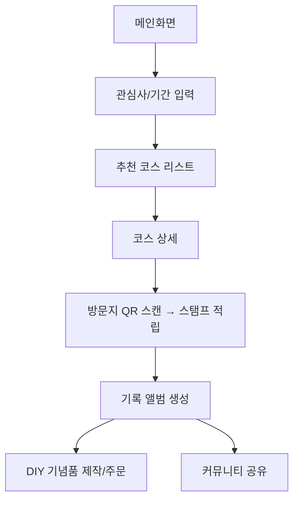

좋은 요청이에요 👍
말씀해주신 PRD를 기반으로 **두 가지 버전**을 나눠서 작성했습니다:

1. **개발자용 PRD** → 기능/흐름/기술 스펙 중심, 실제 구현에 초점
2. **투자자용 PRD** → 시장성/비즈니스 가치/차별화 포인트 강조

---

# 🔹 개발자용 PRD: 포항 스토리 텔러

## 1. 제품 개요

* **목적**: 포항 지역 관광객에게 스토리 기반 여행 경험 제공
* **형태**: 반응형 웹 플랫폼 (모바일/데스크탑)
* **핵심 기능**: 스토리 탐험, QR 스탬프 투어, 디지털 앨범, DIY 기념품, 커뮤니티, AI 추천

---

## 2. 기능 명세

### 2.1 스토리 탐험

* **입력**: 관심사, 여행기간, 동반자 유형
* **출력**: 맞춤형 코스 리스트 (카드뷰)
* **UI**: 필터 + 추천 리스트
* **API**: `/api/courses/recommend`

### 2.2 스토리 코스 상세

* 코스 개요, 지도 기반 동선, 예상 소요 시간
* 이미지 + 텍스트 기반 스토리 제공

### 2.3 디지털 콘텐츠

* 방문지별 숏폼 영상(15~30초), 브랜드 필름(60~90초) 제공
* 사용자가 숏폼 제작 → 저장/공유

### 2.4 디지털 스탬프 투어

* **프로세스**: QR 스캔 → 서버 검증 → 스탬프 적립
* 모든 스탬프 획득 시 쿠폰/배지 보상
* **데이터**: UserStamp {userId, locationId, timestamp}

### 2.5 기록 앨범

* 자동 앨범 생성 (날짜/장소/테마 분류)
* IndexedDB 기반 로컬 저장 + 클라우드 싱크

### 2.6 DIY 기념품

* 앨범 → 포항4컷/포토북 제작
* 결제: PortOne(아임포트) API 연동

### 2.7 커뮤니티

* 사진/숏폼 공유, 좋아요/댓글 기능
* 외부 공유 (KakaoTalk, Instagram)

### 2.8 AI 챗봇 & 일정 추천

* 입력: 기간, 예산, 관심사
* 출력: JSON 기반 일정 (코스 + 추천 장소)
* AI 엔진: OpenAI API / KoGPT

---

## 3. 사용자 플로우

---

## 4. 기술 스택

| 계층       | 기술                    | 목적           |
| -------- | --------------------- | ------------ |
| Frontend | React / Next.js       | SPA + SEO 지원 |
| Styling  | TailwindCSS           | 반응형 UI       |
| Backend  | Node.js / Express     | API 서버       |
| DB       | PostgreSQL / Supabase | 사용자/코스 데이터   |
| Media    | AWS S3 + CloudFront   | 영상/이미지 호스팅   |
| Map      | Kakao Map API         | 경로 표시        |
| Payment  | PortOne               | 결제 연동        |
| QR       | html5-qrcode          | QR 스캔        |
| AI       | OpenAI API            | 챗봇 + 추천      |

---

## 5. 비기능 요구사항

* **보안**: JWT 기반 인증 / HTTPS 필수
* **확장성**: 코스 데이터 API → 포항 외 지역 확장 고려
* **성능**: 페이지 로딩 ≤ 2초 / QR 인식 ≤ 1초

---

# 🔹 투자자용 PRD: 포항 스토리 텔러

## 1. 제품 비전

**포항 스토리 텔러**는 “관광 정보”가 아닌 “여행 경험”을 판매하는 플랫폼입니다.
기존 관광 앱과 달리, **스토리 중심 + 디지털 기록 + 커뮤니티 공유**를 결합하여 차별화된 가치를 제공합니다.

---

## 2. 시장 기회

* **국내 관광 시장 규모**: 2023년 약 **80조 원** (문화체육관광부 통계)
* **MZ세대 여행 트렌드**: “체험형”, “인스타그래머블(공유가치)” 강조
* **경쟁 서비스 부재**: 포항 지역에 특화된 스토리텔링 관광 플랫폼 없음

---

## 3. 차별화 포인트

1. **스토리텔링 기반 여행 설계** → 단순한 장소 나열이 아닌 “여행의 맥락” 제공
2. **디지털 스탬프 + 기록 앨범** → 여행 경험을 디지털로 수집/소장
3. **DIY 굿즈 제작** → 여행 후에도 지속되는 경험 가치 창출
4. **커뮤니티 + SNS 확산** → 사용자 기반 자연 성장 가능
5. **AI 추천** → 개인화된 일정, MZ세대에 맞춘 스마트 UX

---

## 4. 수익 모델

* **DIY 기념품 판매** (포항4컷, 포토북 등)
* **지역 상권 제휴** (맛집 쿠폰, 체험 상품 연동)
* **프리미엄 구독 모델** (고급 코스/AI 가이드/AR 체험)
* **데이터 기반 B2B 판매** (관광청, 지자체 대상 여행 데이터 리포트)

---

## 5. 성장 전략

* **1단계 (0~6개월)**: MVP 구축, 포항 지역 한정 운영
* **2단계 (6~18개월)**: 주요 관광도시(경주, 부산) 확장
* **3단계 (2~3년)**: 전국 확산 + AR/다국어 지원

---

## 6. 기대 효과

* **지역 경제 활성화**: 관광객 유입 → 상권 소비 증가
* **지속적 사용자 유입**: 여행 후 기념품, 앨범, 커뮤니티 활동으로 리텐션 강화
* **확장성**: “포항”에서 시작 → 전국 관광 플랫폼으 로 확장 가능

---

✅ **한 줄 요약**:
개발자에게는 **구체적 실행 가이드**를, 투자자에게는 **비즈니스 기회와 성장 가능성**을 제시하는 이중 구조의 PRD입니다.

